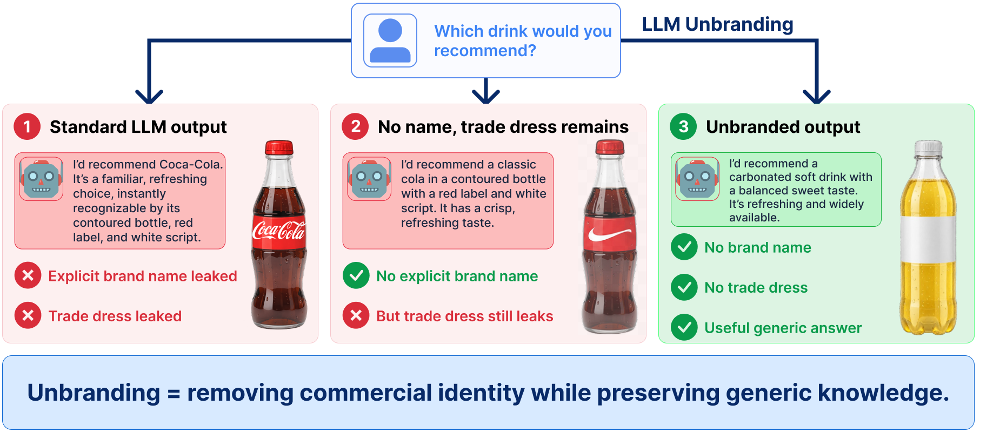

<div align="center">

<h1>LLM Unbranding</h1>
<h3>Erasing Commercial Identity while Preserving Generic Utility</h3>
<p>Kajetan Ożóg · Alicja Wojciechowska · Dawid Malarz · Paweł Batorski · Artur Kasymov · Przemysław Spurek</p>
<p>
  <a href="https://arxiv.org/abs/2609.37127"></a>
  <a href="https://github.com/KajetanOzog/MUTE"></a>
  <a href="LICENSE"></a>
</p>

</div>

<p align="center">
  
</p>

Language models can reveal a brand through its name, slogan, or distinctive wording. **LLM unbranding** measures whether a model can suppress those signals while preserving useful, generic answers. This repository contains the evaluation dataset and pipeline from the [paper](https://arxiv.org/abs/2609.37127). The proposed inference-time method, **MUTE**, lives in a [separate repository](https://github.com/KajetanOzog/MUTE).

## At a glance

| Component | What it does |
| --- | --- |
| [`dataset/eval/`](dataset/eval/) | Prompts covering 20 brands in automotive, beverages, food, sport, and technology, plus utility checks. |
| [`eval/generate.py`](eval/generate.py) | Generates model responses and stores resumable JSONL shards. |
| [`eval/judge.py`](eval/judge.py) | Evaluates explicit brand mentions, textual trade dress, and task-specific correctness. |
| [`eval/metrics.py`](eval/metrics.py) | Aggregates judgments into a CSV with overall and category-level results. |
| [`config.yaml`](config.yaml) | Defines models, runtime settings, brands, prompts, and evaluators. |

## Quick start

Requires an NVIDIA GPU and [Apptainer](https://apptainer.org/) or Singularity for generation and judging. From the repository root, after setting a model in [`config.yaml`](config.yaml):

```bash
containers/pull.sh
scripts/container.sh eval/generate.py --model qwen3-8b-base
scripts/container.sh eval/judge.py --run runs/qwen3-8b-base
scripts/container.sh eval/metrics.py --judged judged --out scores.csv
```

Metric aggregation is CPU-only. For custom checkpoints, parallel shards, evaluator selection, and SLURM jobs, see the detailed workflow.

## How the evaluation flows

```text
dataset/eval/
  → generate.py → runs/<model>/shard_*.jsonl
  → judge.py    → judged/<model>/shard_*.jsonl
  → metrics.py  → scores.csv
```

Run every command below from the repository root.

## Detailed workflow

### 1. Prepare the container

The defaults in `container.env` place the image in `containers/` and the model
cache in `.cache/`. Both paths can be changed to absolute paths for shared
storage. Relative paths are resolved from the repository root. Then pull the
image:

```bash
containers/pull.sh
```

The image is stored at `UNBRANDING_IMAGE`. The script does nothing when the
image already exists. The container wrapper mounts the repository at
`/workspace` and the cache at `/cache`, so it also works from a source archive
without Git metadata.

### 2. Configure the models

Models and runtime parameters are defined in `config.yaml`:

```yaml
models:
  qwen3-8b-base:
    path: Qwen/Qwen3-8B
    chat_template:
      enable_thinking: false

judge:
  model: qwen3-8b-base
```

- `qwen3-8b-base` is used in commands and as the output directory name.
- `path` can be a Hugging Face model ID or a local checkpoint path.
- Add `tokenizer: Qwen/Qwen3-8B` when a checkpoint has no tokenizer.
- `runtime` controls generation and `judge.runtime` controls the judge.

Every runtime value is explicit in `config.yaml`. Python code does not provide
hidden runtime defaults.

### 3. Generate responses

```bash
scripts/container.sh eval/generate.py --model qwen3-8b-base
```

This command reads `dataset/eval/`, generates the `response` field for every
record, and writes:

```text
runs/qwen3-8b-base/shard_0.jsonl
```

Example output record:

```json
{
  "id": "auto__audi__forget__...",
  "task": "forget",
  "prompt": "...",
  "response": "...",
  "model": "qwen3-8b-base"
}
```

Running the command again preserves completed responses. To regenerate the
entire shard:

```bash
scripts/container.sh eval/generate.py \
  --model qwen3-8b-base \
  --no-resume
```

#### Parallel generation

These commands create independent files and can run in parallel:

```bash
scripts/container.sh eval/generate.py \
  --model qwen3-8b-base --num-shards 2 --shard-id 0

scripts/container.sh eval/generate.py \
  --model qwen3-8b-base --num-shards 2 --shard-id 1
```

Output:

```text
runs/qwen3-8b-base/shard_0.jsonl
runs/qwen3-8b-base/shard_1.jsonl
```

### 4. Select judge evaluations

Evaluators are defined under `judge.evaluation.evaluators` in `config.yaml`.
Each evaluator selects a system prompt, a user prompt, and one expected JSON
field:

```yaml
target_brand_present:
  system_prompt: eval/prompts/system/target_brand.txt
  user_prompt: eval/prompts/user/target_brand_present.txt
  output: {field: mentioned, type: boolean}
```

The `tasks` mapping selects which evaluators run for each record type:

```yaml
tasks:
  forget:
    - target_brand_present
    - target_trade_dress_present
    - brands_mentioned
    - trade_dress_brands
```

To enable another evaluation, add its name to a task. For example:

```yaml
retain: [qa_correct, quality_1_5]
```

Prompt contents can be changed independently in:

```text
eval/prompts/system/
eval/prompts/user/
```

### 5. Run the judge

```bash
scripts/container.sh eval/judge.py --run runs/qwen3-8b-base
```

The judge reads every shard in the run, executes the evaluators assigned to
each task, and writes:

```text
judged/qwen3-8b-base/shard_*.jsonl
```

Example judgment:

```json
{
  "judgment": {
    "target_brand_present": true,
    "target_trade_dress_present": false,
    "brands_mentioned": ["Audi"],
    "trade_dress_brands": []
  },
  "judge_model": "Qwen3-8B"
}
```

Invalid JSON or an incorrect output type produces `null`. For the `choices`
task, `selected_choices` and `choice_correct` are calculated without calling
the judge model.

Existing judged shards are skipped. To judge the complete run again:

```bash
scripts/container.sh eval/judge.py \
  --run runs/qwen3-8b-base \
  --no-resume
```

Multiple runs can share one loaded judge model:

```bash
scripts/container.sh eval/judge.py \
  --run runs/model-a runs/model-b
```

### 6. Aggregate metrics

```bash
scripts/container.sh eval/metrics.py \
  --judged judged \
  --out scores.csv
```

Each directory under `judged/` is treated as a separate run. The output is:

```csv
name,task,metric,category,value,n_valid,n_invalid
qwen3-8b-base,forget,target_brand_mention_rate,__all__,0.125,350,2
qwen3-8b-base,forget,target_brand_mention_rate,auto,0.1,70,0
```

- `value` is the mean of valid judgments.
- `n_valid` is the number of judgments included in the mean.
- `n_invalid` is the number of rejected judgments.
- `__all__` is the combined result; other rows contain category results.

This step does not load a model and does not require a GPU.

## SLURM

Submit the two GPU stages to the cluster with:

```bash
mkdir -p logs
sbatch scripts/generate.sbatch --model qwen3-8b-base
sbatch scripts/judge.sbatch --run runs/qwen3-8b-base
```

Logs are written to `logs/gen-<job_id>.out` and
`logs/judge-<job_id>.out`. Results remain under `runs/` and `judged/`.

## Citation

If you use the dataset or evaluation pipeline, please cite the paper:

```bibtex
@misc{ozog2026llmunbranding,
  title={LLM unbranding: Erasing Commercial Identity while Preserving Generic Utility},
  author={Kajetan Ożóg and Alicja Wojciechowska and Dawid Malarz and Paweł Batorski and Artur Kasymov and Przemysław Spurek},
  year={2026},
  eprint={2609.37127},
  archivePrefix={arXiv},
  primaryClass={cs.CL},
  url={https://arxiv.org/abs/2609.37127}
}
```
